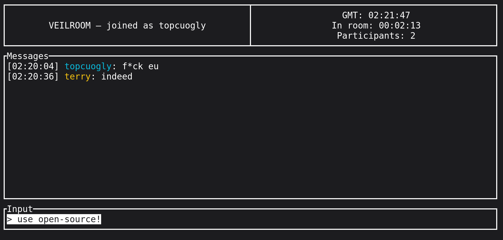

# Veilroom

<p align="center">
  
</p>

> Meet privately. Leave nothing behind.

## Discontinued Project

Veilroom is an **ephemeral, host-controlled private group chat** that runs in the
terminal and connects participants through **temporary Tor v3 onion services**. A
host creates a room that exists only for the lifetime of one process. Chat,
color, and timeout payloads are encrypted and authenticated at the application
layer; membership events are host-signed. The room, its keys, and its
invitation are gone when the host exits.

- **No persistent data.** Messages, identities, keys, invitations, and settings
  are held in memory only and never written to disk.
- **No central Veilroom service.** There is no Veilroom-operated account
  server, room registry, or message relay. Connectivity relies on the Tor
  network and the host's ephemeral onion service.
- **No port forwarding.** Participants reach the host over the Tor network,
  so the host's real IP is never exposed to them.
- **Terminal-native.** A Ratatui interface with an alternate screen, no WebView,
  no browser, and no persistent Veilroom daemon.

The live room header shows current GMT, the viewer's time in the room (room
uptime for the host), and the active non-host participant count. The main menu
also includes an **About Veilroom** screen describing the project's purpose.

Veilroom is written in Rust (edition 2024), runs as one application process
that manages its own isolated `tor` subprocess, and ships as both `.deb` and
`.rpm` packages.

The current application release is **0.2.0**. Its invitation and wire protocol
remain **Veilroom Protocol V1**; the application version and protocol version
are intentionally independent.

---

## Security status

> Veilroom uses standard cryptographic primitives, but its protocol and
> implementation have not undergone independent security review. The current
> release does not provide production security guarantees for high-risk
> secrets.

The tagline is a product position, not a technical guarantee of forensic
erasure. Veilroom does not intentionally write chat, identity, room, or
configuration data to persistent storage, and participants connect through Tor
with application-layer encryption and authentication. However, operating-system,
terminal emulator, swap, core-dump, screenshot, clipboard-history, and other
external traces cannot be absolutely prevented. Terminal scrollback and
terminal emulator recording remain outside the application's control, and
clearing the screen is not described as secure data destruction.

Do not rely on this release for high-risk secrets until the protocol and
implementation have been independently reviewed.

---

## How it works

### Hosting a room

1. Launch `veilroom` and choose **Host a room**.
2. Enter a room password twice (masked) and pick a nickname. The password is
   processed once with **Argon2id** to build the in-memory verifier. The
   plaintext is held only briefly in zeroizing memory and is never written to
   disk, logged, or transmitted.
3. The application starts its own Tor subprocess, waits for bootstrap, and
   creates an **ephemeral v3 onion service** through the Tor Control Protocol
   (`ADD_ONION`, no persistent key file).
4. The host receives an invitation URI:

   ```text
   veilroom://<onion-v3-address>:<port>?v=1&token=<token>
   ```

   Veilroom-generated invitations use a 256-bit random `token` (the V1 parser
   accepts tokens from 128 through 256 bits). The URI never contains the room
   password, a nickname, an identity, or an encryption key.
5. The host shares the URI out of band (messenger, paste, a napkin) and approves
   or rejects join requests from the room screen.

### Joining a room

1. Launch `veilroom` and choose **Join a room**.
2. Paste the invitation URI. It is strictly validated: scheme, onion v3 format,
   port, protocol version, and token are all checked before any connection.
3. Enter the password (masked). The client proves knowledge of the password
   through an **HMAC-SHA-256 challenge-response** — the plaintext password is
   never transmitted as a protocol field, and the host compares the proof in
   constant time.
4. Submit a nickname and an optional short introduction message. The
   introduction is visible only to the host and is discarded after the decision.
5. Wait while the host accepts or rejects the request. On acceptance, an
   X25519/HKDF-derived wrapping key protects a separate epoch-key envelope for
   the new member, and the client enters the room after installing that key.

### In the room

- Chat messages are encrypted with **XChaCha20-Poly1305** and signed with the
  sender's ephemeral **Ed25519** key, carrying an epoch number and a per-sender
  sequence number.
- The room relays messages through the host; a slow or unresponsive client is
  disconnected rather than allowed to block the room.
- Slash commands control membership and administration; see
  [Usage](#usage).

### Lifecycle

`/exit` (host) closes the room, notifies members, shuts down the Tor subprocess,
and removes the session directory. `$XDG_RUNTIME_DIR/veilroom/session-<random>/`
is the only place runtime state ever lives, and it is gone when the room is.
There is no session resumption, recovery, or history. A disconnected person
who still has a valid invitation may start a fresh admission flow with a new
ephemeral identity; the old connection and identity are not restored.

---

## Architecture decisions

The binding wire-level design is documented in
[`docs/protocol-v1.md`](docs/protocol-v1.md). The implementation follows these
key architectural decisions:

### Host-centered star topology
The host is the sole writer of room state and the final administrative
authority. Participants never connect directly to each other. When the host
exits, the room terminates; host migration is out of scope.

### Isolated Tor subprocess
Every interactive host or join session launches its own `tor` subprocess.
There is no dependence on a system-wide Tor daemon. Runtime state lives only under
`$XDG_RUNTIME_DIR/veilroom/session-<random>/` with `0700` permissions; if
`$XDG_RUNTIME_DIR` is missing the application refuses to run rather than
silently falling back to `/tmp`, and it refuses to run as root.

### Ephemeral onion service
Each room is an ephemeral v3 onion service created with `ADD_ONION`. No
onion private key is ever written to disk, `Detach` is not used, and the service
disappears with the controller session. The local target is a Unix domain
socket.

### One-writer room actor
`RoomTask` owns the entire room state (members, pending requests, invitation
token, epoch, sequence counters, limits). Network readers, the TUI, and timers
communicate with it only through typed `RoomEvent` channels. A shared
`Arc<Mutex<RoomState>>` is not the default design.

### Per-connection task model
Every connection has one task that owns the split read/write halves and
multiplexes inbound frames, outbound frames, and keepalives. Each connection
has a bounded outgoing queue. The room never waits on socket writes; a client
whose queue is full is closed instead of silently dropping messages.

### Strict state machines
Both the connection and the room are explicit state machines. A chat message in
`PRE_AUTH` or a join request while `LOCKED` is a protocol violation and is
rejected, never ignored.

### Raw TCP + length-prefixed frames
A single long-lived TCP stream carries frames with a 32-bit big-endian length
header, a protocol-version byte, a message type, and a strict CBOR payload
(Minicbor). Frames over 16 KiB are rejected before the payload is read, and the
CBOR decoder enforces nesting and collection limits, rejects indefinite-length
structures and duplicate keys, and never lets generic CBOR values into room
logic.

### Epoch-based group E2EE
Membership changes (join, leave, lost connection, kick) create a new epoch with
a fresh random 256-bit group key. Each epoch key is wrapped separately for every
current member using an HKDF-derived per-member X25519 key. New members never
receive earlier epoch keys; removed members never receive future ones; messages
carrying an obsolete epoch are rejected.

### Ephemeral identity
Every room connection generates fresh Ed25519 and X25519 key pairs in memory.
They are never written to disk, never reused, and zeroized where practical when
the connection ends. A nickname is a display name, not a security identity.

### Centralized `Limits` and rate limiting
All resource limits live in one structure:

| Limit | Default |
|---|---|
| Active room identities (including the host) | 16 |
| Pending join and timeout requests (combined) | 8 |
| Pre-authentication connections | 16 |
| Frame size | 16 KiB |
| Chat message | 4096 bytes |
| Nickname | 32 Unicode scalar values |
| Introduction | 160 Unicode scalar values |

Active users are rate limited with a token-bucket policy (burst 5, sustained
1/s). Chat messages, color changes, and timeout requests share that bucket. A
failed password proof closes the connection immediately, and the host keeps a
room-lifetime failure count: every five failures start a lockout window (30 s,
doubling per lockout, capped at 15 minutes) during which new admission flows
are refused. Starting a new admission flow is otherwise cheap for anyone
holding the invitation token, so this room-level brake — not the
per-connection one — is what limits password guessing.

---

## Security and anonymity: what it provides

### Network anonymity
- Host and participant real IP addresses are hidden by Tor; participants only
  know the host's onion address.
- No port forwarding, UPnP, NAT traversal, or public listening socket.
- No Veilroom-operated central registry or message relay; Tor remains an
  external network dependency.

### Cryptography (fixed V1 suite, never negotiated)
| Purpose | Algorithm |
|---|---|
| Message and event signatures | Ed25519 (`ed25519-dalek`) |
| Key exchange / per-member wrapping | X25519 + HKDF-SHA-256 |
| Chat confidentiality | XChaCha20-Poly1305 |
| Password KDF | Argon2id |
| Challenge-response proof | HMAC-SHA-256 |
| Constant-time comparisons | `subtle` |
| Secret memory | `zeroize` / `ZeroizeOnDrop` |

- Chat is encrypted and **signed** by the sender (AEAD alone does not prove
  authorship because the group shares a key).
- AEAD additional data binds the protocol version, room session id, epoch,
  sender identity, sender sequence, and message type.
- Signatures and KDFs use explicit, domain-separated canonical transcripts
  (`VEILROOM-HOST-HELLO-V1`, `VEILROOM-CHAT-MESSAGE-V1`, and friends), verified
  against golden test vectors in `docs/test-vectors.md`.
- Replay is rejected at the application layer using a per-sender sequence
  counter, never delegated to TCP.
- Host room events are signed by the host's ephemeral Ed25519 key, so a
  *member* cannot forge a room event or replay an old event as new. This does
  not constrain the host: the host is the only source of the member table, so
  it can introduce a member whose signing key it controls. See
  [What it cannot guarantee](#what-it-cannot-guarantee).

### Admission gate
The room password only grants the right to *apply*. Admission additionally
requires a valid invitation token, an `OPEN` room, and an explicit host
accept. Admin commands are delivered through a local typed channel from the
host TUI — not as remote protocol commands that a client could imitate. There is
no `/ban` command, because with ephemeral identities a ban cannot be honest.

### Data lifecycle
Nothing is ever intentionally persisted: not messages, ciphertext, nicknames,
color preferences, identity keys, epoch keys, the password verifier, the
invitation token, the onion private key, or logs. The TUI keeps only a bounded
in-memory render buffer.

---

## What it cannot guarantee

Be precise about the boundaries of this release:

- No absolute forensic-erasure guarantee: swap, terminal scrollback, terminal
  recordings, screenshots, core dumps, and clipboard histories are outside the
  application's control.
- A person can return with a fresh process, device, or ephemeral identity; only
  the *same ephemeral identity* cannot hold two live connections.
- A malicious host can always withhold messages or close the room.
- **The host defines who is in the room.** Participants learn every member's
  nickname and Ed25519 key only from host-signed membership broadcasts, and
  there is no out-of-band key verification between participants, so a
  malicious host can add a member whose key it holds and speak as them. Chat
  signatures prove authorship *relative to the member table the host
  published*, not relative to a real person.
- Epoch keys are wrapped under a static X25519 exchange, so epoch rotation
  gives key separation across membership changes, not forward secrecy against
  key compromise: whoever obtains the host's or a member's X25519 secret can
  open every recorded epoch of that room.
- Tor is not a defense against denial-of-service on the local system.
- The custom group protocol and this implementation have **not** been
  independently audited.

---

## Threat model snapshot

| Claim | Provided |
|---|---|
| IP anonymity between participants | Yes, via Tor onion services |
| Chat confidentiality and integrity | Yes, XChaCha20-Poly1305 + Ed25519 |
| Forward/backward key separation on membership change | Yes, epoch rotation |
| Replay detection | Yes, per-sender sequence counters |
| No persistent application data | Yes, by design |
| Resistance to forensic capture, malicious host, DoS, re-entry with a fresh identity | **No** — see above |

---

## Quick start

Requirements:

- Rust 1.85 or newer (stable toolchain)
- A `tor` binary on `PATH`, or supplied with `--tor-binary PATH` (needed to
  host or join, not to build)

```bash
cargo build --release
target/release/veilroom
```

Running requires `$XDG_RUNTIME_DIR` to be set and a non-root user. Tor must be
available on `PATH` or through `--tor-binary PATH`; otherwise Veilroom reports
a clear error.

You can also build and run from source with `scripts/run.sh`:

```bash
scripts/run.sh            # build if needed, then start the TUI
scripts/run.sh --version
```

---

## Usage

### Slash commands

| Command | Availability | Effect |
|---|---|---|
| `/help` | all (local) | Show help |
| `/exit` | all (local) | Host: close room and quit; member: leave and quit |
| `/leave` | member | Leave the room and return to the main menu |
| `/color <name>` | all | Choose from the fixed seven-color palette |
| `/color list` | all (local) | Print every color name using that color |
| `/list` | all | Show active room identities |
| `/whois <member>` | all | Show details for an active member |
| `/kick <member>` | host | Remove a member (triggers epoch rotation) |
| `/newid` | host | Rotate the invitation token, invalidating the old URI |
| `/reqon` / `/reqoff` | host | Enable / disable new join requests |
| `/requests` | host | Refresh the live list of pending join and timeout requests |
| `/accept <id>` / `/reject <id>` | host | Decide on a pending join or timeout request |
| `/copy` | host (local) | Copy the full invitation URI to the clipboard |
| `/clear` | all (local) | Clear only the local viewer's message pane |
| `/timeout <seconds>` / `/timeout off` | host | Set or disable per-line timestamp-based expiry (1–3600 s) |
| `/timeoutreq <seconds>` | member | Ask the host for a 1–3600 second room-wide message lifetime |

Unknown commands are **never** sent as chat text. `//text` sends `/text` as a
normal chat message, and raw command text is never transmitted over the network.

The host-side **Requests** panel combines join and timeout requests and updates
when a request arrives, is withdrawn, accepted, or rejected. Both request kinds
use the same room-lifetime numeric id sequence.

For `/whois`, the host view resolves an exact nickname. A member view accepts
either an exact nickname or a numeric member id.

The host pane is for administration only: the host cannot send chat messages
from it. To participate in the conversation, the host joins the room as a
member from a second terminal with the invitation URI.

### Key bindings

| Key | Effect |
|---|---|
| `Ctrl-Y` | Copy the full invitation URI (host) |
| `Ctrl-K` | Hide/show system messages, errors, and notices |
| `Ctrl-T` | Switch host between the host layout and the full-width message layout |

Copying to the clipboard is always an explicit action (via `wl-copy`, `xclip`,
or `xsel`); Veilroom never writes to the clipboard on its own.

---

## Packaging

The release produces both package formats:

- `.deb` via `cargo-deb`, with `Depends: tor`
- `.rpm` via `cargo-generate-rpm`, with `Requires: tor`

Install the two Cargo packaging subcommands if they are not already available:

```bash
cargo install cargo-deb cargo-generate-rpm
```

```bash
cargo deb
cargo generate-rpm
```

The packages install `/usr/bin/veilroom` plus the README, the protocol document,
the test vectors, and the license under `/usr/share`. They do **not** install a
systemd unit, start a daemon, create configuration or data directories, create
an application user, or enable the Tor daemon. Veilroom launches its own Tor
subprocess per session.

`scripts/check-package-contents.sh` and `scripts/clean-install-test.sh` verify
package contents and a clean-environment install.

---

## Testing

```bash
cargo test -- --test-threads=1          # default suite, no Tor required
cargo test -- --ignored --test-threads=1 # all real-Tor tests (needs tor + network)
```

`cargo test` runs the protocol codec, strict CBOR decoding, the cryptography
(validated against the golden vectors in `docs/test-vectors.md`), the room
actor, admission and epoch flows, the transport layer, and a local end-to-end
scenario over a Unix socket — all without using Tor or an external
network.
Property tests guarantee that decoding arbitrary bytes never panics and never
allocates without bound.

The two real-Tor end-to-end tests are intentionally `#[ignore]`d. They launch
isolated Tor processes, create real ephemeral onion services, exercise onion
connectivity (including a host/join/chat flow), and clean up afterward.

Recommended quality gates:

```bash
cargo fmt --all -- --check
cargo check --all-targets
cargo clippy --all-targets --all-features -- -D warnings
cargo test --all-targets -- --test-threads=1
```

---

## Project layout

```text
src/
├── protocol/   Frame codec, strict CBOR messages, handshake, epoch, chat, ids
├── tor/        Tor control protocol, manager, subprocess lifecycle
├── room/       RoomTask, member state, connections, actions, epoch transitions
├── admission/  Host admission gate, join-request queue, client handshake
├── crypto/     Identity keys, transcripts, epoch/chat AEAD, password verifier
├── net/        Host/participant transport, Unix-socket local target, SOCKS
├── chat/       Session relay, outbound queues, replay window, rate limiting
├── ui/         Ratatui screens, bounded render buffer, input, sanitization
├── platform/   Linux runtime-directory safety and clipboard integration
├── app.rs      ApplicationSupervisor: menu, session lifecycle, cleanup
├── uri.rs      Strict veilroom:// invitation parser
├── command.rs  Slash-command parser
├── limits.rs   Single Limits structure
└── constants.rs Protocol constants (single source of truth)

tests/          Integration suites, including the ignored Tor e2e test
docs/           protocol-v1.md (binding spec), test-vectors.md (golden vectors)
scripts/        run.sh, package-content and clean-install checks
```

---

## Documentation

- [`docs/protocol-v1.md`](docs/protocol-v1.md) — the binding Veilroom Protocol
  V1 specification (frames, message IDs, state machines, transcripts, limits).
- [`docs/test-vectors.md`](docs/test-vectors.md) — golden test vectors for the
  cryptographic transcripts and envelopes.

## License

GNU General Public License v3.0 or later (`GPL-3.0-or-later`). See
[`LICENSE`](LICENSE).
